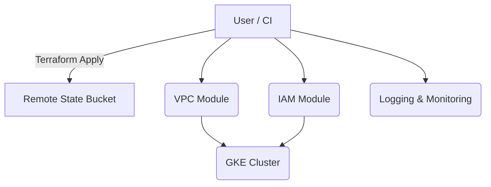
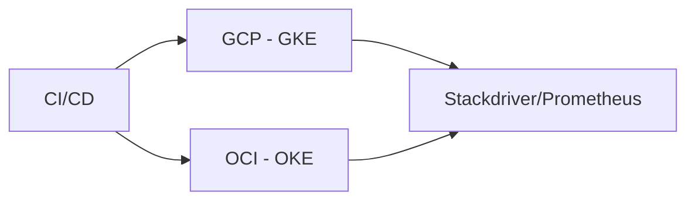

# Sashi Perera — Cloud Architecture Portfolio

**Repo purpose:** A compact, copy-paste-ready portfolio showcasing three high-signal projects you can share on LinkedIn or in job applications:
1. GCP Landing Zone (Terraform) — modular IaC for secure, repeatable environments.
2. Multi-Cloud Demo (GCP + OCI) — sample app deployed across two clouds with centralized CI/CD.
3. GenAI Inference on GKE — lightweight PoC showing GenAI inference with autoscaling and cost controls.

## How to use
1. Replace placeholders (project IDs, bucket names, OCI compartment OCIDs) with your values.
2. Fill in real Terraform variables and providers.
3. Push this repo to GitHub and use the `Featured` section on LinkedIn to link the repo.

## Projects overview

### 1) GCP Landing Zone (Terraform)
- Location: `landing-zone/`
- What it contains: modular Terraform layout (modules for vpc, iam, logging), an example backend config and CI trigger.
- Quick arch (Mermaid):

- Quick start:
  ```bash
  cd landing-zone
  terraform init
  terraform plan -var 'project_id=<GCP_PROJECT_ID>'
  terraform apply -var 'project_id=<GCP_PROJECT_ID>'
  ```

### 2) Multi-Cloud Demo (GCP + OCI)
- Location: `multi-cloud-demo/`
- Minimal app + deployment manifests for both GCP (GKE) and OCI (OKE or compute) to demonstrate cross-cloud deployment and CI pipeline.
- Diagram:


### 3) GenAI Inference on GKE
- Location: `genai-poc/`
- Lightweight inference service (Flask) containerized and deployed to GKE with autoscaling and request queueing pattern.
- Notes about safety, cost controls, and token limits are included.

## Files of interest
- `landing-zone/` — Terraform skeleton and modules
- `multi-cloud-demo/` — simple app, Dockerfile, Kubernetes manifests
- `genai-poc/` — Flask inference PoC and deployment hints
- `cloudbuild.yaml` — sample Cloud Build pipeline to build and push images & deploy.
- `README.md` (this file) — customize and push as public portfolio.

## Suggested commit message
`chore: add cloud-portfolio skeleton (GCP landing zone, multi-cloud demo, GenAI PoC)`

## Push to GitHub (example)
```bash
git init
git add .
git commit -m "chore: add cloud-portfolio skeleton (GCP landing zone, multi-cloud demo, GenAI PoC)"
gh repo create sashi-cloud-portfolio --public --source=. --remote=origin
git push -u origin main
```
(If you don't have `gh`, create a repo in the GitHub UI and follow the push instructions.)
